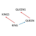

#  Word2Vec APIs **flow**ground Connector

## Description

A generated **flow**ground connector for the Word2Vec APIs API (version 1.0.2).

Generated from: https://api.apis.guru/v2/specs/apitore.com/word2vecApis/1.0.2/swagger.json 
Generated at: 2019-05-07T17:36:52+03:00

## API Description

Word2Vec. [Endpoint] https://api.apitore.com/api/8

## Authorization

This API does not require authorization.

## Actions

### Word2Vec analogy

> Word2Vec JaWikipedia 2016-9-15 dump. Response &nbsp; Github: <a href="https://github.com/keigohtr/apitore-response-parent/tree/master/word2vec-response">word2vec-response</a> &nbsp; Class: com.apitore.banana.response.word2vec.AnalogyResponseEntity 

*Tags:* `word-2-vec-controller`

#### Input Parameters
* `access_token` - _required_ - Access Token
* `positives` - _required_ - positive1 positive2 ...[space separated strings]
* `negatives` - _optional_ - negative1 negative2 ...[space separated strings]
* `num` - _optional_ - num [max 10, default 1]

### Word2Vec distance

> Word2Vec JaWikipedia 2016-9-15 dump. Response &nbsp; Github: <a href="https://github.com/keigohtr/apitore-response-parent/tree/master/word2vec-response">word2vec-response</a> &nbsp; Class: com.apitore.banana.response.word2vec.DistanceResponseEntity 

*Tags:* `word-2-vec-controller`

#### Input Parameters
* `access_token` - _required_ - Access Token
* `word` - _required_ - word
* `num` - _optional_ - num [max 10, default 1]

### Word2Vec similarity

> Word2Vec JaWikipedia 2016-9-15 dump. Response &nbsp; Github: <a href="https://github.com/keigohtr/apitore-response-parent/tree/master/word2vec-response">word2vec-response</a> &nbsp; Class: com.apitore.banana.response.word2vec.SimilarityResponseEntity 

*Tags:* `word-2-vec-controller`

#### Input Parameters
* `access_token` - _required_ - Access Token
* `word1` - _required_ - word1
* `word2` - _required_ - word2

### Word2Vec distance (Vector version)

> Word2Vec JaWikipedia 2016-9-15 dump. Response &nbsp; Github: <a href="https://github.com/keigohtr/apitore-response-parent/tree/master/word2vec-response">word2vec-response</a> &nbsp; Class: com.apitore.banana.response.word2vec.DistanceResponseEntity 

*Tags:* `word-2-vec-controller`

#### Input Parameters
* `access_token` - _required_ - Access Token
* `vector` - _required_ - vector [length 200]
* `num` - _optional_ - num [max 10, default 1]

### Word2Vec wordvector

> Word2Vec JaWikipedia 2016-9-15 dump. Response &nbsp; Github: <a href="https://github.com/keigohtr/apitore-response-parent/tree/master/word2vec-response">word2vec-response</a> &nbsp; Class: com.apitore.banana.response.word2vec.WordVectorResponseEntity 

*Tags:* `word-2-vec-controller`

#### Input Parameters
* `access_token` - _required_ - Access Token
* `word` - _required_ - word

## License

**flow**ground :- Telekom iPaaS / apitore-com-word-2-vec-apis-connector 
Copyright © 2019, [Deutsche Telekom AG](https://www.telekom.de) 
contact: flowground@telekom.de

All files of this connector are licensed under the Apache 2.0 License. For details
see the file LICENSE on the toplevel directory.
